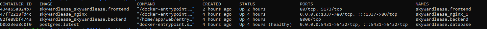
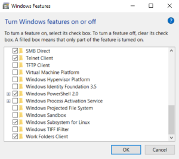
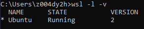

# SkywardLease 

Skywardlease is a platform designed to facilitate the rental and management of Unmanned Aerial Vehicles (UAVs), also known as drones.

## Used Technologies

<!-- HTML table -->
<table>
<tr>
<td>Django Project<br></td>
<td>Postgre SQL<br></td>
<td>React<br></td>
<td>TypeScript<br></td>
<td>Tailwind<br></td>
<td>NGINX<br></td>
<td>Gunicorn<br></td>
<td>Docker<br></td>


</tr>
</table>

## Table of Contents

- [SkywardLease](#skywardlease)
  - [Used Technologies](#used-technologies)
  - [Table of Contents](#table-of-contents)
  - [Quick Start](#quick-start)
- [How to install WSL on windows](#how-to-install-wsl-on-windows)
  - [Enable WSL](#enable-wsl)
  - [WSL 2](#wsl-2)
  - [Install WSL Ubuntu](#install-wsl-ubuntu)
  - [Install Docker to WSL](#install-docker-to-wsl)
  - [References](#references)


## Quick Start

Use terminal and navigate to the project root. 

- Clone the repository with the following command:

```bash
git clone https://github.com/sualpemre/skywardlease.git
```

- Then open a command prompt, navigate to the location where you cloned the project using the command prompt
```bash
cd skywardlease
```

:warning: **Note:** If you have docker-compose your local machine go next step.
- Run wsl:
```bash
wsl
```
:warning: **Note:** If you don't have wsl installed on your machine, [👉 click](#with-wsl).


- Then run following commands on wsl:
```bash
docker-compose up -d --build
```  
```bash
docker ps
```  


- Open your browser:
    - FrontEnd:
        <code>http://localhost:1337/</code>
    - BackEnd: 
        <code>http://localhost:1337/api/</code>
        


# How to install WSL on windows

## Enable WSL 
        
- Open Turn Windows features on or off and check Windows Subsystem for Linux
    

- On the first enablement of WSL, Windows will download required packages and will prompt to restart for completing the installation

## WSL 2

- Windows, by default, installs WSL 1. However, we need WSL 2 to run docker containers.

- Open elevated Powershell and run:
```bash
dism.exe /online /enable-feature /featurename:VirtualMachinePlatform /all /norestart
```  

- Then run in cmd or powershell
```bash
wsl --update
```    

- after completed, set wsl version to 2 by running
```bash
wsl --set-default-version 2
```  

## Install WSL Ubuntu
```bash
wsl --install -d ubuntu
```      

- Important: Save password that you set during the installation. For administrative commands, you will need to enter that password

- After install, it will login into ubuntu. To check the WSL version, type exit to leave WSL and run:
```bash
wsl -l -v
```     

- If you see version 2, we are good to install docker into WSL
    
    

## Install Docker to WSL

- You can login to WSL Ubuntu by:
```bash
wsl
``` 

- On the very first login, run the following for security updates:
```bash
sudo apt update && sudo apt upgrade
``` 

- Important
  - To avoid any potential conflicts with using WSL 2 Docker Engine, you must uninstall any previous versions of Docker Engine and CLI installed directly  through Linux distributions or Docker Desktop.

- Install Dependencies(ignore temporary warnings/errors during installation)
```bash
sudo apt install -y \
        apt-transport-https \
        ca-certificates \
        curl \
        software-properties-common
``` 

- Add Docker GPG Key
```bash
curl -fsSL https://download.docker.com/linux/ubuntu/gpg | sudo gpg --dearmor -o /usr/share/keyrings/docker-archive-keyring.gpg
```  

:warning: **Note:** If above command does not run and throws error as "Could not resolve host: download.docker.com", its because network connectivity issues [can happen](https://github.com/microsoft/WSL/issues?q=is%3Aissue+label%3Anetwork) with WSL 2, and tweaking the DNS settings often resolves these problems by running the following(skip if does not fail)
```bash
echo -e "[network]\ngenerateResolvConf = false" | sudo tee -a /etc/wsl.conf sudo unlink /etc/resolv.conf echo nameserver 1.1.1.1 | sudo tee /etc/resolv.conf
``` 
    
- Add the Docker repository to your APT sources
```bash
echo "deb [signed-by=/usr/share/keyrings/docker-archive-keyring.gpg] https://download.docker.com/linux/ubuntu $(lsb_release -cs) stable" | sudo tee /etc/apt/sources.list.d/docker.list > /dev/null
``` 

- Update the package list again
```bash
sudo apt update
```   
- Install the Docker engine
```bash
sudo apt install -y docker-ce docker-ce-cli containerd.io
``` 
- when done, check the docker service status by
```bash
sudo systemctl status docker
```   

- or check the version
```bash
docker --version
```     

- Manage Docker as a Non-root User (Optional):
```bash
sudo usermod -aG docker $USER 
newgrp docker
```   


## References

- [https://learn.microsoft.com/en-us/windows/wsl/install](https://learn.microsoft.com/en-us/windows/wsl/install)
- [https://learn.microsoft.com/en-us/windows/wsl/install-manual#step-3---enable-virtual-machine-feature](https://learn.microsoft.com/en-us/windows/wsl/install-manual#step-3---enable-virtual-machine-feature)
- [https://dev.to/bowmanjd/install-docker-on-windows-wsl-without-docker-desktop-34m9](https://dev.to/bowmanjd/install-docker-on-windows-wsl-without-docker-desktop-34m9)
- [https://raw.githubusercontent.com/bonben365/linux/main/docker-install.sh](https://raw.githubusercontent.com/bonben365/linux/main/docker-install.sh)